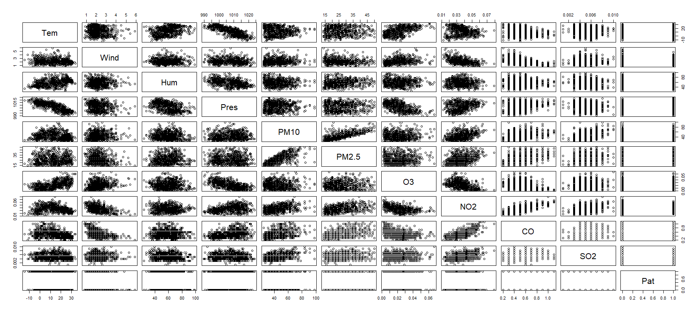
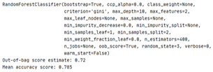
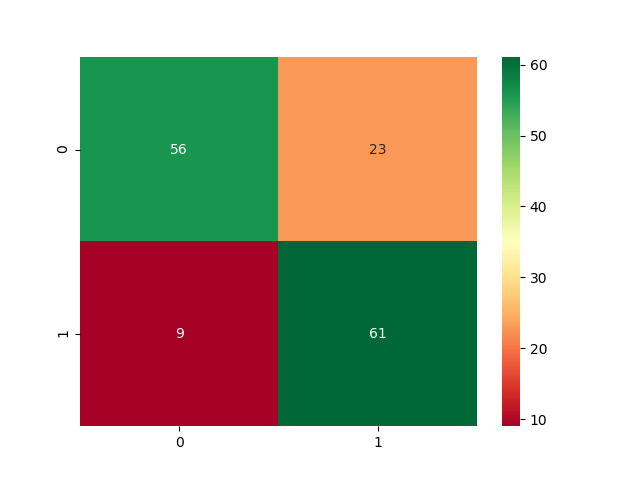
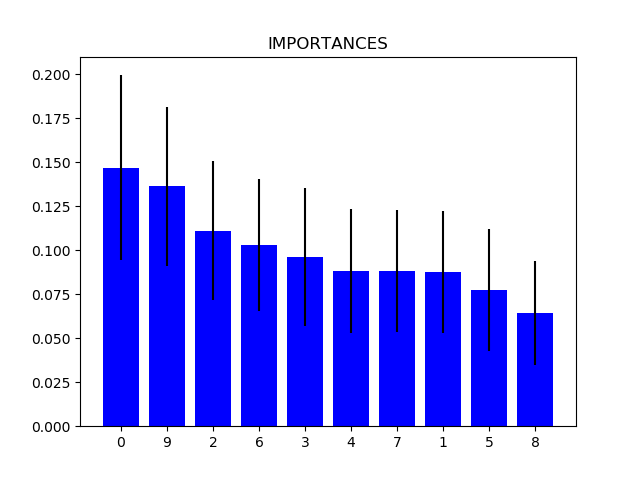
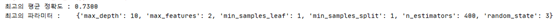
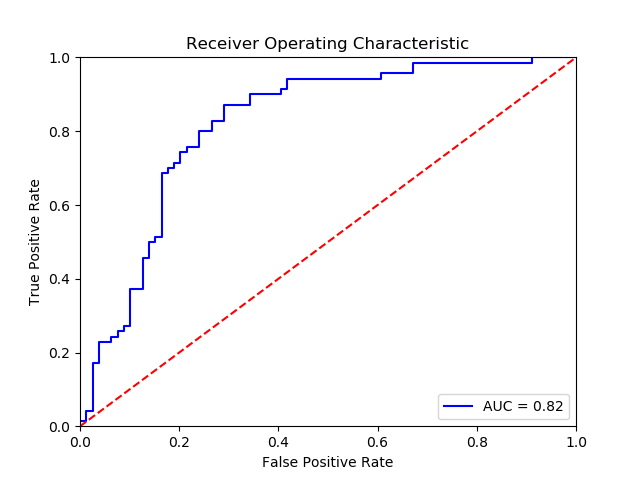
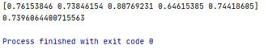

# ai-project-tutorial
# 1. 프로젝트 주제
- 날씨와 미세먼지 농도에 따른 정신 질환 발생 정도 예측 모델 설계
## 1-1. 주제 선정 계기
- 기존의 날씨와 정신 질환 연관성을 확인한 연구 다수 존재
- 미세먼지가 정신 질환을 일으키는 원인이 아직 밝혀지지 않았으나 연관성을 연구한 논문 존재, 미세먼지가 정신 질환 관련 연구는 부족한 편

## 1-2. 최근 증가한 정신 질환 관련 범죄율과 자살률
- 정신질환 범죄자 수 (자료 : 검찰청) : 2013년 5,858 -> 2017년 9,027
- 인구 10만 명당 자살사망률 (자료 : 서울특별시 자살 사망 분석 결과보고서) : 2017년 전국사망률 24.3 -> 서울 정신질환 사망률 157.9

## 1-3. 따라서 날씨와 미세먼지에 따른 정신 질환 발생 정도를 예측하여 정신 질환 관련 범죄와 자살 예방 모델에 기여하고자 주제 선정

# 2. 기존 연구 소개(접근방법) 및 한계점
## 2-1. 기존 연구 소개
### 2-1-1. 서울대 보건대학원·건강환경연구소·분당서울대병원 공동 연구팀
- 2003∼2013년 사이에 우울증과 조현병 등 정신질환에 의한 응급 입원 8만634건을 대상으로 초미세먼지(PM 2.5) 노출과 연관성을 분석
- 초미세먼지 농도가 이틀 평균 10㎍/㎥ 증가 시 정신질환에 의한 응급 입원이 0.8% 증가
- 날씨가 추울 때보다 따뜻할 때 초미세먼지와 함께 일산화탄소·이산화질소·오존·이산화황 등 대기오염 물질 중 하나라도 수치가 높을수록 연관성이 더 커짐
### 2-1-2. Liu Jia Jia,Wang Feng,Liu Hui,Wei Ya Bin,Li Hui,Yue Jingli,Que Jianyu,Degenhardt Louisa,Lappin Julia,Lu Lin,Bao Yanping,Wang Jing. "Ambient fine particulate matter is associated with increased emergency ambulance dispatches for psychiatric emergencies" Environmental research VOL.177 NO.- (2019)
- PM2.5농도가 10μF3씩 증가 시 정신질환에 의한 응급 구급차 파견이 0.12% 증가하고, 자살 관련으로는 0.12% 증가

## 2-2. 기존 연구 접근방법 (Environmental research VOL.177 NO.- (2019))
### 2-2-1. 접근 방법 
- 시계열 분석을 통해 2008년부터 2014년까지 중국에서 가장 오염이 심한 도시 중 하나인 베이징(EPE)에서 PM2.5의 단기 노출과 정신 질환 응급 구급차 파견 사이의 연관성 조사
- 연령, 성별, 계절적 패턴의 영향을 조사하기 위해 계층화된 분석 수행
### 2-2-2. 결과
- PM2.5농도가 10μF3씩 증가할 때마다 전체 EPE(95% CI:0.03-0.22%, p=0.013)가 0.12% 증가하고, 2에서 자살 관련 EPE가 0.12% 증가하는 것과 관련 (95%)
### 2-2-3. 한계점
- 최신 데이터가 아님 : 2008년부터 2014년까지의 데이터 사용
- 전체 입원 데이터 사용하지 않음, 지역적 특성 다름 : 정신질환에 의한 응급입원 데이터와 중국 베이징 데이터 사용
- 통계적인 수치로만 표시 : 구체적인 머신러닝 기법 활용

# 3. 사용 데이터 (수집 데이터)
- 기간 : 2013.10.01 ~ 2018.12.31. (약 5년, 일 단위)
- [Data](ai-project-tutorial/RawData/)

## 3-1. 날씨 데이터 : 일일 평균 기온, 평균 풍속, 평균 습도, 평균 기압
- 기상청 (서울 지점번호 : 108) (일별)
- https://bd.kma.go.kr/kma2019/svc/main.do

## 3-2. 미세먼지 데이터 : 일일 미세먼지 농도, 초미세먼지 농도
- 서울시 일별 평균 대기오염도 정보(종로구 - 서울 기상 관측 지점 위치)
- http://data.seoul.go.kr/dataList/OA-2218/S/1/datasetView.do

## 3-3. 정신 질환 진단 데이터 : 진료일자(요양개시일자), 상병코드(F___) -> 환자 수 수집
- 2013.10.01 ~ 2018.12.31 진료내역정보
- 국민건강보험공단
- https://www.data.go.kr/data/15007115/fileData.do
- 상병코드 F00-F99(정신 및 행동 장애) 

# 4. 데이터 전처리
- [Code](Preprocessing/Preprocessing.R)
## 4-1. 데이터 (1918행)
- 독립변수(연속형) : 기온, 풍속, 상대습도, 기압, 미세먼지(PM10), 초미세먼지(PM2.5), 오존(O3), 이산화질소(NO2), 일산화탄소(CO), 아황산가스(SO2)
- 종속변수(연속형) : 환자 수

## 4-2 NULL 값 제거 (Deletion(omission) : Delecting rows (listwise))
- 환자 수 데이터 NULL 값 행 삭제 : 1772행으로 축소
- 대기오염 데이터 NULL 값 행 삭제 : 1742행으로 축소
- 날씨 데이터 NULL값 행 삭제 : 1738행으로 축소

## 4-3 날짜 열 삭제 : 11열(독립변수 10개+종속변수 1개), 1738행 

## 4-4 데이터 이상치 탐지 : IQR(Inter Qunatile Range, Q3-Q1)와 임의 제거
- 각 데이터 4분위 수 확인
- outlier을 처리할 변수 선정 : 환자 수(Pat), 미세먼지(PM10), 초미세먼지(PM2.5)
- outlier 제거
- Q1-1.5(IQR)와 Q3+1.5(IQR)에 해당하는 값 제거 + 분류에 적합하지 않은 데이터 추가로 제거
   - 환자 수를 7~100명 범위로 제한 : 935행
   - 미세먼지를 25~100 범위로 제한 : 730행
   - 초미세먼지를 14~50 범위로 제한 : 649행

## 4-5. 환자 수 데이터 범주화
- 7 ~ 61 : 0 (안전) - 324행
- 61 ~ 100 : 1 (위험) - 325행  

## 4-6. 변수 간 상관관계 확인

## 4-7. 독립변수 간 다중공산성 (독립변수 간 상관관계) 확인 
- 분산팽창요인(VIF) 사용
- 분산팽창계수가 10 초과인 독립변수 제거
  - 10 초과 독립변수가 존재하지 않으므로 제거될 독립변수 없음

 
# 5. 머신러닝
- Y(종속변수) : 일별 환자 수(Pat) (안전 : 0, 위험 : 1)
- X(독립변수) : 기온(Tem), 풍속(Wind), 습도(Hum), 기압(Pres), 미세먼지 농도(PM10), 초미세먼지 농도(PM2.5), 오존(O3), 이산화질소(NO2), 일산화탄소(CO), 아황산가스(SO2)
- training data : 500, test data : 149
- Random Forest : 지도학습, 분류
- [Code](ModelingCode/RandomForest.py)

## 5-1. RandomForestClassifier 함수
- RandomForestClassifier(bootstrap=True, class_weight=None, criterion='gini',
            max_depth=None, max_features='auto', max_leaf_nodes=None,
            min_impurity_decrease=0.0, min_impurity_split=None,
            min_samples_leaf=1, min_samples_split=2,
            min_weight_fraction_leaf=0.0, n_estimators=10, n_jobs=None,
            oob_score=False, random_state=None, verbose=0,
            warm_start=False)
## 5-2. RandomForestClassifier 함수의 매개변수
- n_estimators: 랜덤포레스트로 만들 트리의 개수 (결정트리개수)
- max_features: 각 트리별로 컬럼 개수 선택 각 트리의 랜덤성 결정
- max_depth: 최대 깊이
- min_samples_leaf : 리프 노드가 되기 위한 최소 샘플 데이터 수
- min_samples_split : 노드를 분할하기 위한 최소 데이터 수
- max_leaf_nodes : 최대 리프 노드의 개수
## 5-3. 매개변수 설정 (XGBoost를 통해 선정)
- n_estimators = 400
- max_features = 2
- max_depth = 10
- min_samples_leaf = 1 
- min_samples_split = 2

## 5-4. 모델 실행
- 실행 결과

- RandomForest는 약 78%의 정확도를 보임

## 5-5 변수 중요도
- 실행 결과

## 5-6. 모델 최적화 및 평가
### 5-6-1 모델 최적화
- Bootstrapping : 랜덤 포레스트에서 기본적으로 사용
- Gradient Boosting : XGBoost
- 하이퍼파라미터 튜닝 gridsearchcv(n_estimators=결정트리의 개수, max_depth : 트리의 깊이, colsample_bytree = 컬럼의 샘플링 비율(RF의 max_features), learning_rate = 학습률, min_split_loss = 리프 노드를 추가적으로 나눌지 결정하는 값 등등)

### 5-6-2. 모델 평가
- Confusion matrix (분류 성능 평가) : 코드 (Python), ROC 그래프

- AUC = 0.82로 1에 가까움 (보통 성능)
- K-fold cross validation

# 6. 결론 및 기대효과
## 6-1. 결론 
- 날씨와 미세먼지에 따른 정신질환 발생 정도 예측에 Random Forest는 78%의 정확도
- 예측에 많은 영향을 주는 독립변수로는 SO2, 기온, 습도, O3, 기압, 미세먼지 농도

## 6-2 기대 효과
- 날씨와 미세먼지에 따른 정신질환 발생 정도의 연관성 확인
  - 기후 변화와 미세먼지 관련 정책 마련 동기 부여
  - 정신질환으로 인한 범죄 및 자살 예측 모델 기여

# [참고 문헌]
- Liu Jia Jia,Wang Feng,Liu Hui,Wei Ya Bin,Li Hui,Yue Jingli,Que Jianyu,Degenhardt Louisa,Lappin Julia,Lu Lin,Bao Yanping,Wang Jing. "Ambient fine particulate matter is associated with increased emergency ambulance dispatches for psychiatric emergencies” Environmental research VOL.177 NO.- (2019)
- Peters R, Ee N, Peters J, Booth A, Mudway I, Anstey KJ. “Air Pollution and Dementia: A Systematic Review. J Alzheimers Dis”. 2019 Feb 11 doi: 10.3233/JAD-180631
- 이승복, “미세먼지가 인체에 미치는 영향에 관한 연구 동향”, BRIC View 동향리포트  2019-T26, page7-8
- 박상현, “대기오염, 미세먼지 그리고 응급의학”, 2019년도 대한응급의학회 추계학술대회, page1
- 김길원, "초미세먼지, 날 풀리면 더 위험…정신질환 응급입원 증가”, 연합뉴스, 2019-02-11 06:03, https://www.yna.co.kr/view/AKR20190208118500017
